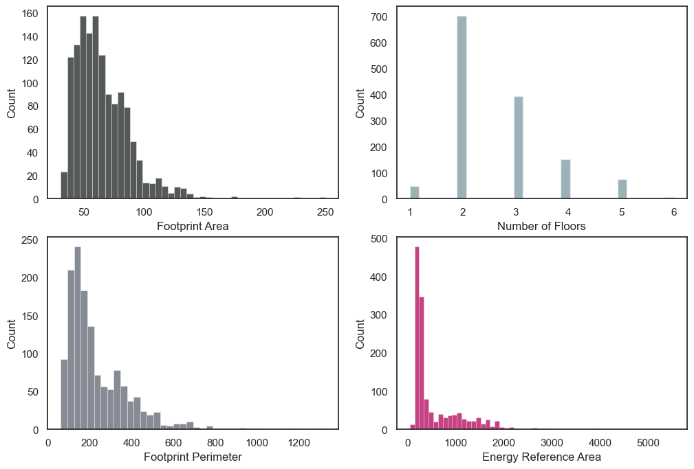

## Estimating Energy Reference Area of Residential Buildings in Switzerland

### Summary

The energy reference area (ERA) is the sum of all gross floor area above and below ground that requires heating or air conditioning for occupancy. 

This exercise is about exploring a way to estimate ERA of buildings located in Switzerland by using geo-spatial datasets. The choice of the predictors, gross area, footprint area and number of floors, is based on the study conducted by [Thomas Schluck et al 2019 J. Phys.: Conf. Ser. 1343 012031](https://doi.org/10.1088/1742-6596/1343/1/012031) Additionally, in this exercise footprint perimeter is also used as a predictor:

### Data Sources

Data about 2200 buildings has been gathered from GeoAdmin API and matched by building id to their respective certification information.

For each building, Minergie certificate data has been requested from https://www.geocat.ch/geonetwork/srv/eng/catalog.search#/metadata/ad60a67c-f0a0-41fa-84f2-20b8565c9da9

Building register information 'swiss_buildings.csv' has been requested via API calls from: https://www.geocat.ch/geonetwork/srv/eng/catalog.search#/metadata/56553efe-4a2c-449d-93ba-cf7edd518d56 and merged with additional information about ERA for each building taken from https://www.minergie.ch/de/gebaeude/ 

Building footprint geometry data 'building_geometries.gpkg' was obtained from https://data.geo.admin.ch/browser/index.html#/collections/ch.bfe.solarenergie-eignung-fassaden/items/solarenergie-eignung-fassaden 

Since all these datasets are quite large, by using geopandas, osgeo and SQL queries only data for certain buildings was extracted for the purpose of this exercise.

### Disclaimer:

This project contains information taken from https://api3.geo.admin.ch/ and https://www.minergie.ch/de/gebaeude/

I do not own these data. The data is open access and available under these terms: https://www.geo.admin.ch/en/general-terms-of-use-fsdi